# Students Management

🗓️ Developed during the December of 2020

⚙️ The managing companion tool of this app can be seen [here](https://github.com/MadalinDolca/ControlPanel).

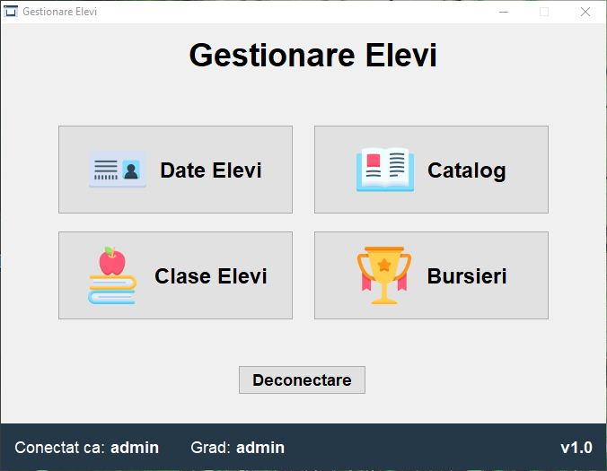

## 🌟 Features
- User authentication
- Role-based access
- Database connection handler
- Network connection handler
- **Students Data**
  - Show every student of the school and their data
  - Show the history of student data changes
  - Add a new student to the system
  - Update the data of a selected student
- **Classes**
  - View all the students of a selected class
  - Add a student to a class
  - Move a student to another class
- **Gradebook**
  - Show the grades of a student in a certain class from a certain subject
  - Add a new regular grade or the term paper's grade 
  - Modify an existing grade
  - Delete an existing grade
  - Export the student's grades to a file
  - Show the arithmetic mean of the grades obtained by the selected student at a selected subject
  - Mark the absence of a selected student to the selected subject
  - Modify a selected absence
- **Schoolarships**
  - View all the students that have the selected scholarship
  - Assign students to scholarships
  - Chnage the scholarship of a selected user

## 🔮 Technologies
- Java for the app logic
- Java Swing for the UI
- MySQL database
- MySQL Connector to connect to the database

## 👀 Preview

| Login | Main interface (teacher) |
| - | - |
| 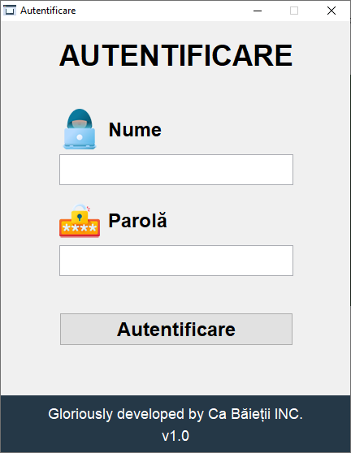 | 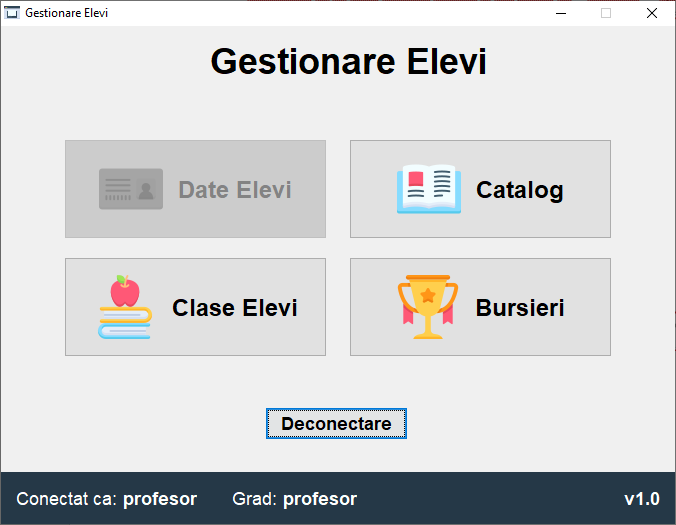 |

### Students data

| Students data | Logs |
| :-: | :-: |
| 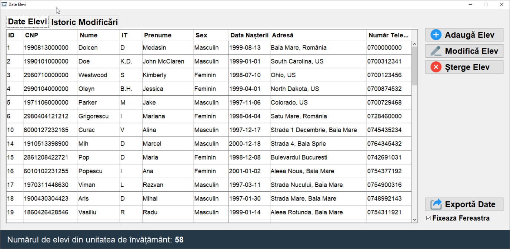 | 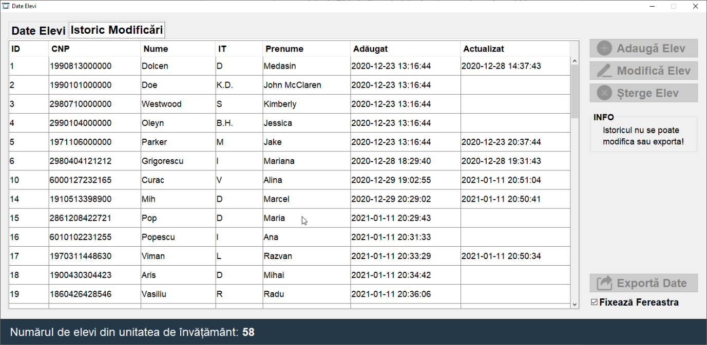 |
| Add student data | Update student data |
| 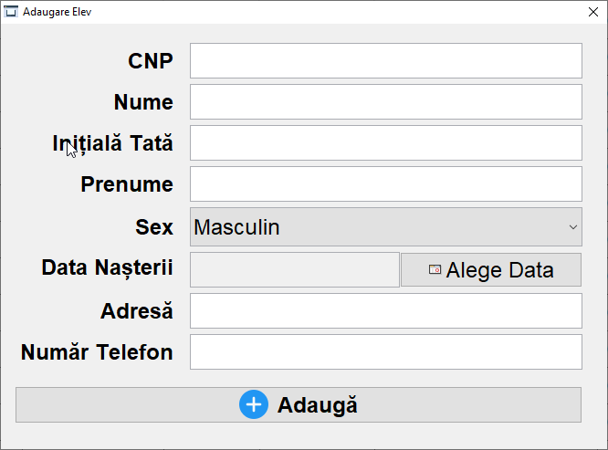 | 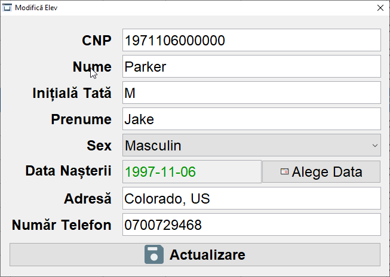 |

### Class view

| Class view (admin) | Class view (teacher) |
| :-: | :-: |
| 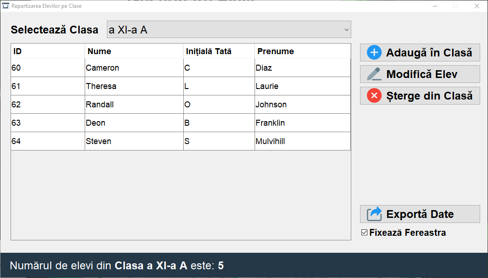 | 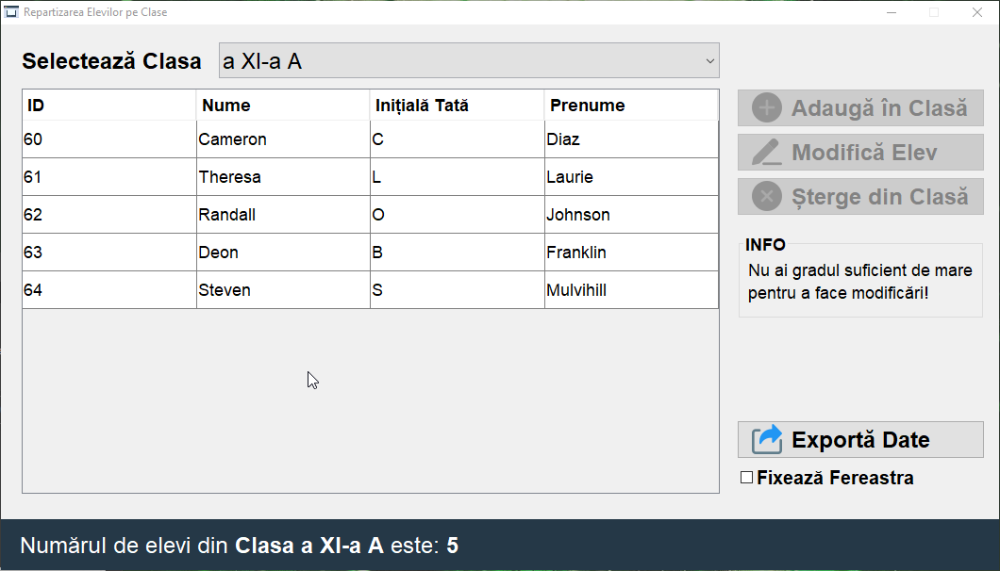 |
| Add student to class | Change student class |
| 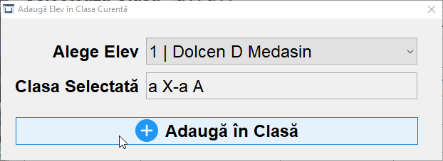 | 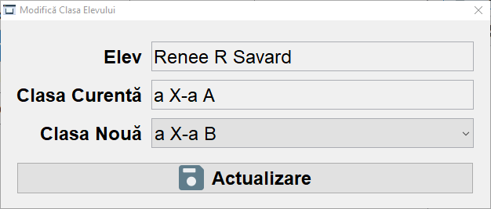 |

### Gradebook

| Gradebook view | Select student  |
| :-: | :-: |
| 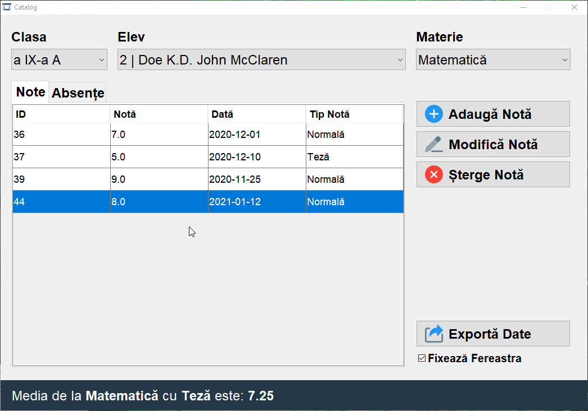 | 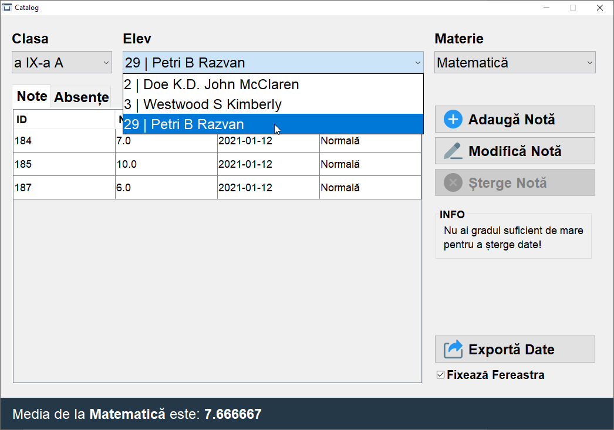 |
| Select subject | Export notes
| 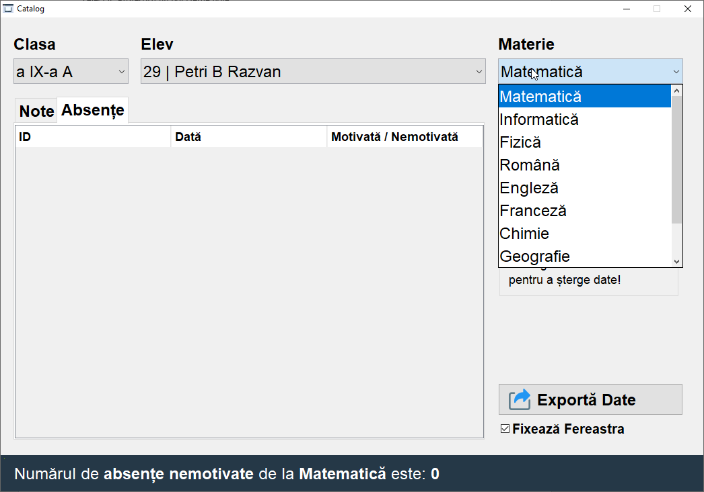 | 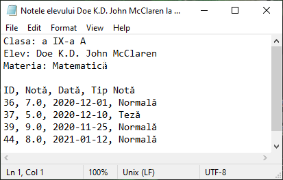 |
| Add grade | Modify grade |
| 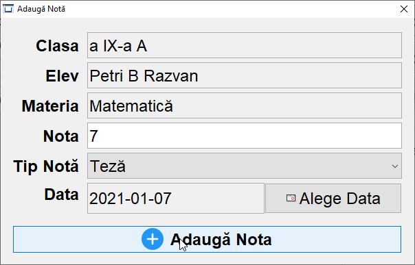 | 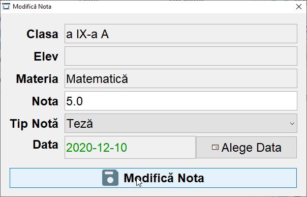 |
| Add absence | Modify absence |
| 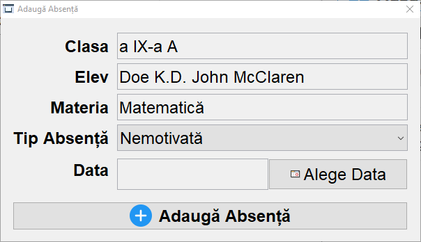 | 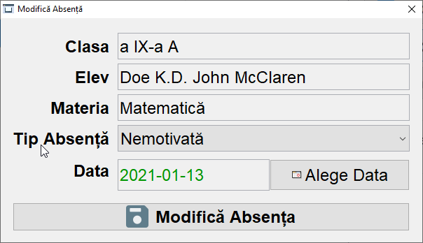 |

### Scholarships

| Scholarships (teacher view) | Select scholarship |
| :-: | :-: |
| 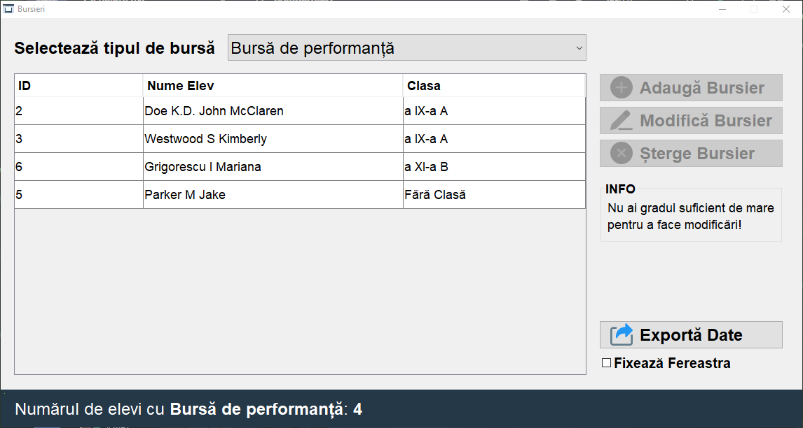 | 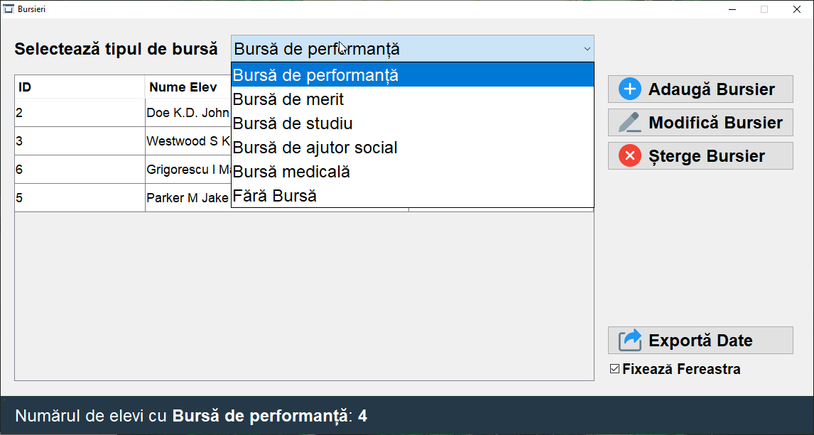 |
| Add scholarship | Update student scholarship |
| 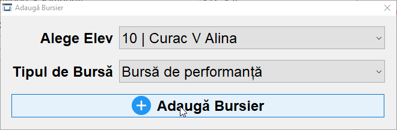 |  |
