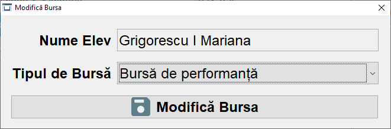

# Students Management

🗓️ Developed during December of 2020

## Preview

| Login | Main interface (teacher) |
| - | - |
|  |  |

### Students data

| Students data | Logs |
| :-: | :-: |
|  |  |
| Add student data | Update student data |
|  |  |

### Class view

| Class view (admin) | Class view (teacher) |
| :-: | :-: |
|  |  |
| Add student to class | Change student class |
|  |  |

### Gradebook

| Gradebook view | Select student  |
| :-: | :-: |
|  |  |
| Select subject | Export notes
|  |  |
| Add grade | Modify grade |
|  |  |
| Add absence | Modify absence |
|  |  |

### Scholarships

| Scholarships (teacher view) | Select scholarship |
| :-: | :-: |
|  |  |
| Add schoolarship | Update student schoolarship |
|  |  |
